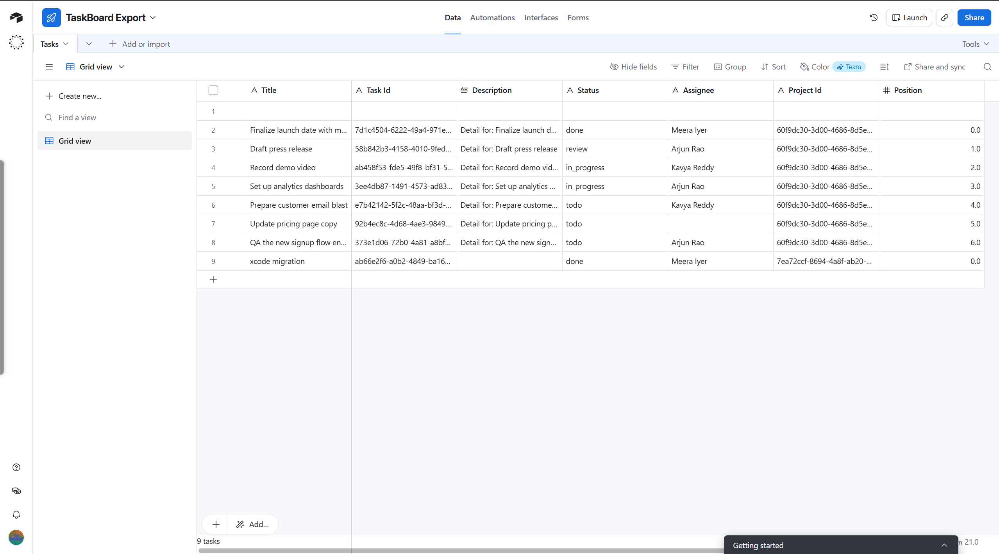

# Terminal log

Session log for the TaskBoard assignment (local Docker). Commands abbreviated for clarity; responses captured from the running app.

---

## 1. Setup

```text
docker compose up --build -d
docker compose exec backend python manage.py migrate
docker compose exec backend python manage.py seed
```

Seed users available (`password123`): meera@taskboard.dev, arjun@taskboard.dev, kavya@example.com, dev@example.com, lina@example.com.

App: http://localhost:3000 · API: http://localhost:8000

---

## 2. Initial test run

```text
docker compose exec backend python -m pytest
# 15 passed

docker compose exec frontend npm test
# Test Files  2 passed (2)
# Tests  9 passed (9)
```

---

## 3. Bug curl proof (Part 1 / before fix)

Non-member `lina@example.com` PATCHes a Q3 Launch task (should be forbidden):

```bash
# After login as Meera → project 97c6468a-… → task e91bac59-…
curl -s -X PATCH http://localhost:8000/api/tasks/e91bac59-a0c2-42bd-ba55-5bd512fc8659 \
  -H "Authorization: Bearer <lina_token>" \
  -H "Content-Type: application/json" \
  -d '{"title":"HACKED BY NON-MEMBER","status":"done"}'
```

**HTTP 200** response (bug):

```json
{"task":{"id":"e91bac59-a0c2-42bd-ba55-5bd512fc8659","title":"HACKED BY NON-MEMBER","status":"done", ...}}
```

Task title restored afterward so seed data stays intact.

---

## 4. Fix curl proof (Part 2 / after fix)

Same request after membership + role checks on `PATCH`:

```json
{"error":"forbidden"}
```

**HTTP 403**

Regression tests: `test_non_member_cannot_patch_task`, `test_viewer_cannot_patch_task`, `test_member_can_patch_task` — passed.

---

## 5. Part 3a — Comments demo

```bash
curl -s -X POST http://localhost:8000/api/tasks/e91bac59-…/comments \
  -H "Authorization: Bearer <meera_token>" \
  -H "Content-Type: application/json" \
  -d '{"body":"Looks good for launch — checking analytics next."}'
# HTTP 201 — comment with author + createdAt

curl -s -X POST http://localhost:8000/api/tasks/e91bac59-…/comments \
  -H "Authorization: Bearer <dev_viewer_token>" \
  -d '{"body":"…"}'
# HTTP 403 {"error":"viewers cannot post comments"}
```

UI: task detail modal shows chronological comments; viewers can read, not post.

---

## 6. Part 3b — Activity feed demo

```bash
curl -s -H "Authorization: Bearer <meera_token>" \
  http://localhost:8000/api/projects/97c6468a-…/activity
```

Example payload (newest first):

```json
{"activities":[{"action":"comment.added","actor":{"name":"Meera Iyer"},"metadata":{"title":"Finalize launch date with marketing"},"createdAt":"…"}]}
```

UI: **recent activity** section on the project page. See `DESIGN_NOTES.md` for transactional write policy.

---

## 7. Part 3c — Airtable export

### Unit tests (mock)

```text
TestExport::test_viewer_cannot_export PASSED
TestExport::test_export_upserts_and_isolates_failures PASSED
TestExport::test_transient_retry_then_succeeds PASSED
```

### Live base (requires your PAT)

Follow [`AIRTABLE_SETUP.md`](AIRTABLE_SETUP.md), set `AIRTABLE_*` in `.env`, recreate backend, then:

```bash
curl -s -X POST http://localhost:8000/api/projects/<project_id>/export \
  -H "Authorization: Bearer <meera_token>"
# Expect: {"exported":N,"created":N,"updated":0,"failed":0,"errors":[]}

# Second run (idempotent upsert by Task Id):
# Expect updated >= 1, no duplicate Task Id rows in Airtable
```

UI: **export to Airtable** on the project detail page (admin/member only).

**Live demo (full schema):**

```text
EXPORT 1 → {"exported":7,"created":7,"updated":0,"failed":0,"errors":[]}  HTTP 200
EXPORT 2 → {"exported":7,"created":0,"updated":7,"failed":0,"errors":[]}  HTTP 200
Sample fields: Task Id, Title, Description, Status, Assignee, Project Id, Position
```

Open the Airtable **Tasks** base to verify rows. Proof screenshot (TaskBoard Export → Tasks grid after live export):



- Screenshot file: [`airtable-export.png`](airtable-export.png) (repo root, same level as `REVIEW.md`)

---

## 8. Final test run

```text
docker compose exec backend python -m pytest
# 33 passed

docker compose exec frontend npm test
# Test Files  2 passed (2)
# Tests  9 passed (9)
```

---

## Commits (local, not squashed)

```text
docs: add REVIEW.md with prioritized findings and curl proof
fix: require membership and edit role on task PATCH
feat: comments, activity feed, and Airtable export
docs: TERMINAL_LOG, RECORDING placeholder, README API updates
fix: harden authz, search, Airtable schema checks, and stale JWT login
```
